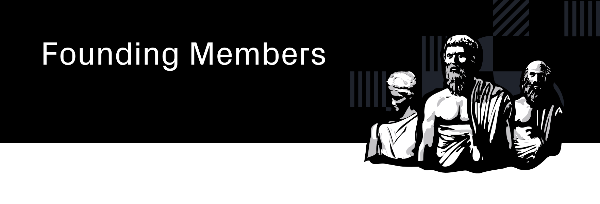

  <h3>A repo to store information about the Founding Member program.<h3>

  <h4>
    <a href="/rules.md">
      Rules
    </a>
     | 
    <a href="/roles/council-members">
      Website
    </a>
     | 
    <a href="/status.md">
      Status
    </a>
    </a>
  </h4>

 

Table of Content
==

<!-- TOC START min:1 max:3 link:true asterisk:false update:true -->
- [Overview](#overview)
<!-- TOC END -->

# Overview
